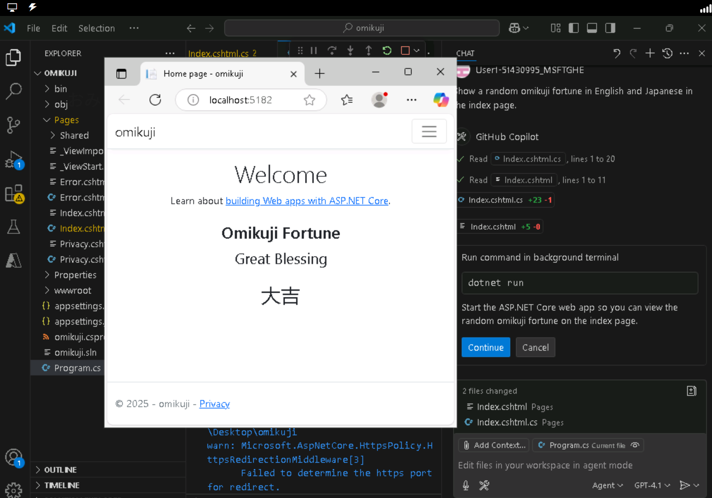

# GitHub Copilot agent mode lab

You'll use GitHub Copilot agent mode to create a simple [Omikuji](https://japan-forward.com/fortune-on-a-paper-strip-where-to-find-english-omikuji-in-tokyo/) (fortune-telling) web app.

The entire procedure takes approximately 1 hour (including 30 minutes waiting time).

**After starting the lab, please wait 30 minutes before continuing.** This will avoid sign-in issues.

## Create a Microsoft account (if you don't have one)
  - https://signup.live.com/signup

## Start the lab
  - Visit https://esi.learnondemand.net/
  - Click "Sign in"
  - Click "Microsoft Account" and sign in
  - Enter your training key
    - The training key will be sent to you by the instructor via chat.
  - Start the Lab

## Sign in to Windows in the lab environment
  - Click "Resources" on the top right of the screen
  - Sign in to Windows using the password displayed in the bottom right of "Resources" under "Virtual Machine"
  - Please perform the following operations in this lab Virtual Machine.

## Wait 30 minutes
  - **Please wait 30 minutes here before continuing.** This will avoid sign-in issues.

## Sign in to GitHub
  - Open the Edge browser
  - Open https://github.com/enterprises/Microsoft-APL/sso
  - "Single sign-on to Microsoft GHE" → click "Continue"
  - Sign in with the username (e.g. User1-12345678@LODSPRODMCA.microsoft.com) and password displayed in the upper right corner of "Resources"
  - "Stay signed in?" → "Yes"
  - "Save password?" → "OK"
  - If https://github.com/enterprises/Microsoft-APL/ is displayed, it's OK.
    - If the "Single sign-on to Microsoft GHE" → "Continue" screen is displayed repeatedly or an error screen saying "What!?" is displayed, close the Edge browser, wait 10-15 minutes, and then try again.

## Install the latest version of Visual Studio Code
  - Enter "VSCode" in the address bar of the Edge browser and search the internet
  - Go to the VSCode download page
  - Download the VSCode Installer (User Installer) for Windows
  - "... do you want to keep anyway?" → click "Keep"
  - Open the downloaded installer
  - Click "I accept ..." and then click "Next".
  - Click "Next"
  - Click "Install"
  - Wait a moment and click "Finish"

## Sign in to use GitHub Copilot in VSCode
  - Click the user icon (Accounts) at the bottom left of the VSCode
  - "Sign in with GitHub to use Copilot..." → Click "Sign in". Edge browser will open.
  - "Select user to authorize..." → Click "Continue" green button next to the user name (e.g. User1-12345678_MSFTGHE)
  - Click "Authorize Visual-Studio-Code" green button
  - "This site is trying to open Visual Studio Code" → "Open"

## Create and open a folder in Visual Studio Code
  - Click "Open Folder" (or "File" → "Open Folder..." from the menu)
  - Go to "Desktop"
  - Click "New Folder" and enter "omikuji" (fortune-telling)
  - Click on the "omikuji" folder and click on the "Select Folder" button
  - "Do you trust the author of the files in this folder?" → "Yes, I trust the authors"

## Open GitHub Copilot chat (agent mode)
  - Click on the Copilot icon at the top of the screen to start chat
  - Click "Ask" on the bottom right of the chat view and switch to Agent mode

## Create an omikuji (fortune telling) web app

*The detailed behavior of the agent here may differ each time you run it. Please follow the instructions displayed in the actual chat.
  - Type the following prompt in chat
  - `Create a .NET C# web app that shows a random omikuji fortune in English and Japanese in the index page.`
  - Enter (or click the Send button)
  - The "dotnet new webapp" command to create a web app is suggested. Click Continue to run it.
  - The web application is created. Also, index.cshtml / index.cshtml.cs is rewritten to display a random fortune.
  - Click "Keep"

## If the dotnet new webapp command does not finish even though the project files are created...

  - Click 'Cancel' in the chat window to stop the agent
  - Type the following prompt in chat
  - `Show a random omikuji fortune in English and Japanese in the index page.`
  - Enter (or click the Send button)
  - Click "Keep"

## Run the web app
  - Open `Program.cs`
  - Click the "Run" button (right-facing triangle) on the top right of the editor
  - The Edge browser opens and displays a random fortune for you. Good luck!

## If the fortune is not displayed properly...
  - Click the square button in VSCode to stop a running web app
  - Type the following prompt in chat
  - `omikuji not shown`
  - Enter (or click the Send button)
  - The correction will be performed. Click "Keep"
  - Open Program.cs
  - Click the "Run" button (right-facing triangle) on the top right of the screen
  - The Edge browser opens and displays a random fortune.

## If it still doesn't work...

  - Go back to the steps in "Create and open a folder in Visual Studio Code" and create a new folder such as "omikuji2" and try again.

